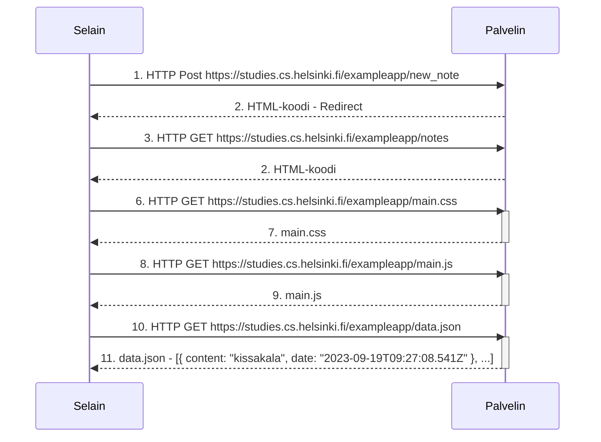

```mermaid
sequenceDiagram
    participant Selain
    participant Palvelin

    Selain->>Palvelin: 1. HTTP Post https://studies.cs.helsinki.fi/exampleapp/new_note
    Palvelin-->>Selain: 2. HTML-koodi - Redirect
    Selain->>Palvelin: 3. HTTP  GET https://studies.cs.helsinki.fi/exampleapp/notes
    Palvelin-->>Selain: 2. HTML-koodi
    Selain->>Palvelin: 6. HTTP GET https://studies.cs.helsinki.fi/exampleapp/main.css
    activate Palvelin
    Palvelin-->>Selain: 7. main.css
    deactivate Palvelin
    Selain->>Palvelin: 8. HTTP GET https://studies.cs.helsinki.fi/exampleapp/main.js
    activate Palvelin
    Palvelin-->>Selain: 9. main.js
    deactivate Palvelin
    Selain->>Palvelin: 10. HTTP GET https://studies.cs.helsinki.fi/exampleapp/data.json
    activate Palvelin
    Palvelin-->>Selain: 11. data.json -  [{ content: "kissakala", date: "2023-09-19T09:27:08.541Z" }, ...]
    deactivate Palvelin

```