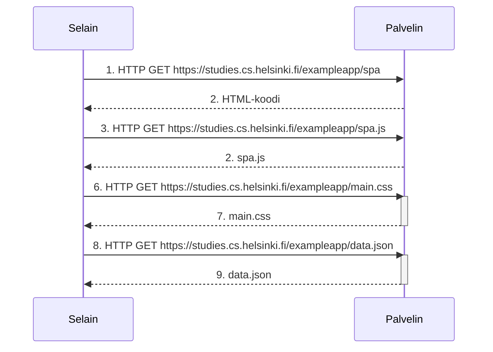

```mermaid
sequenceDiagram
    participant Selain
    participant Palvelin

    Selain->>Palvelin: 1. HTTP GET https://studies.cs.helsinki.fi/exampleapp/spa
    Palvelin-->>Selain: 2. HTML-koodi
    Selain->>Palvelin: 3. HTTP  GET https://studies.cs.helsinki.fi/exampleapp/spa.js
    Palvelin-->>Selain: 2. spa.js
    Selain->>Palvelin: 6. HTTP GET https://studies.cs.helsinki.fi/exampleapp/main.css
    activate Palvelin
    Palvelin-->>Selain: 7. main.css
    deactivate Palvelin
    Selain->>Palvelin: 8. HTTP GET https://studies.cs.helsinki.fi/exampleapp/data.json
    activate Palvelin
    Palvelin-->>Selain: 9. data.json
    deactivate Palvelin
 

```